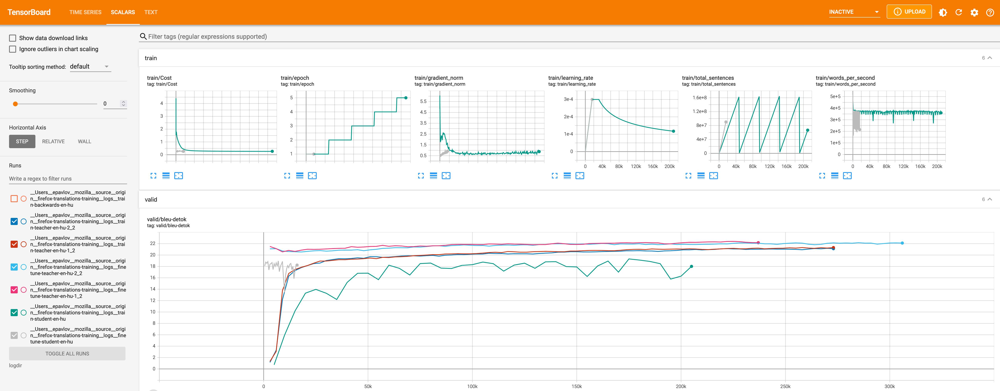

# Model Training Guide

A step-by-step guide on how to train a translation model.

The configuration of a training run happens mostly in a training configuration file.
Look at the examples of the [full production configs for Taskcluster](https://github.com/mozilla/translations/tree/main/configs).

See [Development documentation](../contributing/development.md) for details on setting up the development environment.

## 1. Choose a language

First, choose a language pair to train.

Considerations:
- The size of the parallel corpus on [OPUS](https://opus.nlpl.eu/)
- Availability of monolingual data. The pipeline requires monolingual data in both source and target languages.

We use two-letter ISO 639-1 language codes, for example for Russian to English: `ru`, `en`.

Explore available supported datasets:

1. Go to [OPUS](https://opus.nlpl.eu/) and see how much parallel data is available for the language pair
2. Use [find-corpus](https://github.com/mozilla/translations/tree/main/utils/find-corpus.py) tool. 
Install [poetry](https://python-poetry.org/) and [Taskfile](https://taskfile.dev/installation/) first, then run:
```bash
task find-corpus -- ru en
```

Translation quality will depend on the amount of training data and its quality.
Currently, we define three language groups based on the number of available parallel sentences:

| sentences, million | Category        | Training                                                                     | Expected quality |
|--------------------|-----------------|------------------------------------------------------------------------------|------------------|
| 80 and more        | High resource   | Easy to train, but resource intensive                                        | competitive      |
| 20-80              | Medium resource | Requires more monolingual data                                               | usable           |
| less than 20       | Low resource    | Challenging to train a good model, requires even more back-translations etc. | low              |


## 2. Generate the configuration file

Use the config generator to generate default version of the config file:

```bash
task config-generator -- ru en --name test
```

The config will be generated in the `configs/autogenerated` directory.

Then change the language pair and the name of your experiment:
```yaml
experiment:
  name: test-quality
  src: ru
  trg: en
```

See the full config schema in [taskcluster/translations_taskgraph/actions/train.py](https://github.com/mozilla/translations/blob/main/taskcluster/translations_taskgraph/actions/train.py).

## 3. Modify datasets

### Parallel corpus

Look at the `datasets.train` section:

```yaml
datasets:
  train:
    - opus_ada83/v1
    - mtdata_Statmt-news_commentary-15-eng-rus
    ...
```
1. Look what's there and remove old versions of datasets
   (for example there should be only the latest version of ParaCrawl should be left)
2. Deduplicate datasets between OPUS and mtdata.
   If the versions are the same, it's preferable to use OPUS ones as it is a more stable resource (for example, remove mtdata ParaCrawl if there is `opus_ParaCrawl/v9` in the list).


In the pipeline, the segments (which mostly include one sentence) will be deduplicated based on the source and target segments. 
However, if different datasets contain the same source segment, and different target segment, they will all be retained.

### Evaluation datasets

`datasets.devtest` section - datasets for validation while training

`datasets.test` section - datasets for final evaluation when a model is trained

For example:
```yaml
  devtest:
    - flores_dev
    - sacrebleu_wmt19
    - sacrebleu_wmt17
  test:
    - flores_devtest
    - sacrebleu_wmt20
    - sacrebleu_wmt18
```

Choosing dataset:
- Flores dataset is available for 100 languages, so it's always included in the config.
- Sacrebleu datasets from WMT competition are worth including.
- Some OPUS and mtdata datasets provide dev and devtest versions, so it's a good idea to add them to evaluation.
- Make sure that training, validation and evaluation datasets are different.
- Remove redundant datasets. For some high resource languages, config-generator includes too many.
- The rule of thumb is to use 3-4 for validation and as many as you're interested in for final evaluation (`test`).

### Monolingual corpus
It is recommended to use back-translations to augment training data by training a model in reversed direction and then 
translating a monolingual corpus in target language to the source language
(see [Improving Neural Machine Translation Models with Monolingual Data](https://aclanthology.org/P16-1009.pdf)).

It is also important to use monolingual corpus in source language to augment data for decoding by the teachers 
to improve teacher-student knowledge distillation (see [Sequence-Level Knowledge Distillation](https://arxiv.org/abs/1606.07947)).

Those techniques are useful even for high-resource languages but especially useful for low-resource ones. 
The only limitation is probably available computational resources.

Check available monolingual data in `datasets.mono-src` and `datasets.mono-trg`.
```yaml
  # to be translated by the teacher
  mono-src:
    - news-crawl_news.2020
    - news-crawl_news.2019
    ...
  # to be translated by the backward model to augment teacher corpus with back-translations
  mono-trg:
    - news-crawl_news.2020
    - news-crawl_news.2019
    ...
```
Using [News Crawl](https://data.statmt.org/news-crawl/) datasets from statmt is preferable because they are relatively clean.
Other datasets might be noisy and require manual inspection before adding them, especially for back-translations.

Limit the number of lines for monolingual datasets by modifying the following settings:
```yaml
  mono-max-sentences-src:
    total: 500_000_000
    per-dataset: 200_000_000
  mono-max-sentences-trg:
    total: 200_000_000
    per-dataset: 200_000_000
```

### Custom datasets

It is also possible to use manually downloaded datasets with prefix `url_<url>`.

Find more details about the supported dataset importers [here](../data-and-cleaning/datasets.md).

For example:
```yaml
  mono-trg:
  - url_https://storage.googleapis.com/releng-translations-dev/data/mono-nllb/nllb-mono-ru.txt.zst
```

## 4. Configure data cleaning

The default configuration should work.

Enable OpusCleaner [custom cleaning rules](https://github.com/mozilla/translations/tree/main/pipeline/clean/opuscleaner/configs) if you want to use them for your language pair.
```yaml
  opuscleaner-mode: custom
```

For more details on data cleaning see the documents on [Data cleaning](../data-and-cleaning/index.md) and [Bicleaner](../data-and-cleaning/bicleaner.md).

## 5. Using pretrained models

If there is already trained backward model, it is possible to reuse it:
```yaml
  pretrained-models:
     train-backwards:
      url: "https://firefox-ci-tc.services.mozilla.com/api/queue/v1/task/bAHmHRsZTXmwig3eyJHThw/artifacts/public/build"
      mode: use
      type: default
```

A student model can be used for back-translation.

See more details on using pretrained models [here](using-pretrained-models.md).

## 6. Set hyperparameters

The pipeline supports overriding the default [Marian settings](https://marian-nmt.github.io/docs/cmd/marian/) in the training config. The default settings are in the `pipeline/train/configs` directory,
for example [teacher.train.yml](https://github.com/mozilla/translations/tree/main/pipeline/train/configs/training/teacher.train.yml) and in the [train.py](https://github.com/mozilla/translations/tree/main/pipeline/train/train.py) script.

### Model training

#### Vocabulary

Use separate SentencePiece vocabularies for source and target languages if they have different scripts (for example, Latin and Cyrillic).
```yaml
spm-vocab-split: true
```

The default size of SentencePiece vocabulary is 32k, increase to 64k when using a joint vocabulary for CJK languages.
```yaml
spm-vocab-size: 64000
```

#### Teacher ensemble

Change to 1 not to use an ensemble of two teachers. The ensemble is more expensive to train and run decoding for, 
but provides only marginal quality improvements
```yaml
teacher-ensemble: 1
```

#### Student architecture

"base-memory", "base" or "tiny" based on [Bergamot configurations](https://github.com/browsermt/students/tree/master/train-student/models).
"tiny" is smaller and faster. "base" produces translations of higher quality, and "base-memory" is a memory optimized version of "base".
```yaml
student-model: tiny
```

More details about the performed experiments are in [this issue](https://github.com/mozilla/translations/issues/174).

#### Early stopping
Early stopping can be increased to make sure that training converges.
However, it depends on the language and might not bring much benefit but will make the training longer.
So, you can start with `early-stopping: 20`, monitor the training and increase it if the model stops training too early.

A student model might train for too long due to data augmentations in [OpusTrainer](opus-trainer.md).
Reducing early-stopping helps in this case.
```yaml
marian-args:
# these configs override pipeline/train/configs
  training-backward:
    early-stopping: 5
  training-teacher:
    early-stopping: 20
  training-student:
    early-stopping: 15
```

#### Curriculum learning

[OpusTrainer](opus-trainer.md) supports training in multiple stages on different mixes of datasets.

By default, we use a two-stage training for teacher models.

The first stage is pretraining on a mix of the original parallel corpus and back-translated texts 60% to 40% for two epochs.
The second stage is fine-tuning on the original parallel corpus only until early stopping.

Sometimes, if there are issues with the parallel corpus, the model won't finetune and stop training too early.
In this case, we support switching to one-stage training on the mix of the back-translated to the original corpus 30:70.

```yaml
teacher-mode: one-stage
```

#### Optimizer delay
Make sure to set `optimizer-delay` so that `GPU devices * optimizer-delay = 8`.
It makes training more stable.

#### Subword regularization
```
sentencepiece-alphas: 0.5
```
SentencePiece alphas control the alpha parameter in subword sampling for the unigram model. 
It improves robustness of the model, especially for unseen domains. 

If not specified, Marian does not run SentencePiece sampling (corresponds to `alpha=1`). 
Lower values (`0.1`, `0.2`) increase randomization and might benefit lower resource languages with less diverse datasets. 
However, the model might not train at all if the alpha is too low. 
The recommended value to start with is `0.5`.

More details:
- [SentencePiece readme](https://github.com/google/sentencepiece?tab=readme-ov-file#subword-regularization-and-bpe-dropout)
- Paper [Subword Regularization: Improving Neural Network Translation Models with Multiple Subword Candidates](https://arxiv.org/pdf/1804.10959.pdf)

### Decoding (translation)

It's used for producing back-translations and for knowledge distillation.

#### Decoder type

Besides Marian, the pipeline supports CTranslate2 for faster decoding. CTranslate2 does not support ensembles.

```yaml
teacher-decoder: ctranslate2
```

#### Batch size

`mini-batch-words` can be set depending on available GPU memory and the number of teachers.
It affects the batch size and decoding speed for the `translate` steps.
```yaml
marian-args:
...
  decoding-backward:
    # 12 Gb GPU, s2s model
    mini-batch-words: 2000
  decoding-teacher:
    # 12 Gb GPU, ensemble of 2 teachers
    mini-batch-words: 1000
```

#### Half precision decoding

Make sure to use it only for teacher models and on GPUs that support it.
It speeds up decoding but can slightly decrease quality.
```yaml
marian-args:
...
  decoding-teacher:
    # 2080ti or newer
    precision: float16
```

### OpusTrainer settings

You can adjust data augmentation settings to increase robustness of the translation and
tune how to mix back-translated corpus with the original one in the
[OpusTrainer configs](https://github.com/mozilla/translations/tree/main/pipeline/train/configs/opustrainer/).

See [OpusTrainer docs](opus-trainer.md) for more details.

## 7. Run the pipeline

Follow the instructions that correspond to the workflow manager you will be using 
([Taskcluster](task-cluster.md), [Snakemake](snakemake.md)).

Find the full description of the pipeline steps [here](pipeline-steps.md).

### Cluster specific configuration

The Marian workspace is usually safe to set to about 3/4 of available GPU memory 
(in a [profile for Snakemake](https://github.com/mozilla/translations/tree/main/pipeline/train/train.py) and throughout the ci steps in Task cluster).
Setting a higher value speeds up training but might lead to out of GPU memory error.

### Taskcluster

Follow [this guide](task-cluster.md) to run the pipeline on Taskcluster.

You can run it up to a specific step using a config setting. 
For example to only train the teacher model:
```
target-stage: train-teacher-model
```

### Snakemake

After everything is configured do `make run`. It will compile Marian and other tools first which is important to do on the target machine in cluster mode.

If you want to inspect data  first, run 
```bash
make run TARGET=merge_corpus
```

Find more details in the [Snakemake doc](snakemake.md).

## 8. Monitor progress

### Logs

Look at the logs of the pipeline steps and specifically at `train.log` for the training steps (`train-...`, `finetune-...`).

### Metrics

Check logs or output files `*.metrics.json` for `evaluate` steps to see the BLEU, chrF and COMET scores calculated on evaluation datasets.

For Snakemake check `models/<lang-pair>/<experiment>/evaluation` folder.

### Weights and Biases

Taskcluster jobs log training updates, evaluation metrics, dataset sizes, configs and other information to the public Weights and Biases dashboards:
[https://wandb.ai/moz-translations/projects](https://wandb.ai/moz-translations/projects).
Each W&B project corresponds to a language pair. Each group of runs corresponds to a Taskcluster task group (triggered by a "Train" action).
A group is named in the following format `<experiment_name_from_config>_<task_cluster_group_id>`.

### Tensorboard

It is possible to look at the training graphs in Tensorboard.

#### Taskcluster
When the training run is completed, provide a Task group id and download the training logs to a directory. 
For example for [this task group](https://firefox-ci-tc.services.mozilla.com/tasks/groups/DClbX0cjSCeQuoE1fW-Ehw):
```bash
task download-logs -- --task-group-id DClbX0cjSCeQuoE1fW-Ehw
```
#### Snakemake
Adjust the path to match the model directories in makefile `tensorboard`  command and remove `--offline` to automtically update while training.

#### Run server

```bash
task tensorboard
```

Then go to `http://localhost:6006` in the browser



Known issue: the [marian-tensorboard](https://github.com/marian-nmt/marian-tensorboard) tool we're using
parses the trainig logs only for the student models and validation logs for all models for some reason.

## 9. Download the final model

The small quantized model is available in bergamot-translator compatible format as an output of the `export` step.
It includes three files: model, vocab and shortlist.

For example:
```
model.ruen.intgemm.alphas.bin.gz
lex.50.50.ruen.s2t.bin.gz
vocab.ruen.spm.gz
```

## Troubleshooting

### Dataset downloading fails

Sometime external resources we download the dataset from are unavailable.
Retry the downloading steps. 
If it still fails, remove those datasets from the config.
Taskcluster retries automatically.

### Out of GPU memory

Reduce the Marian workspace or batch size.

### Out of disk

It happens on Taskcluster, because we train on increasingly large datasets especially close to the end of the pipeline. 
Just increase the disk size, it's cheap compared to the GPUs.
