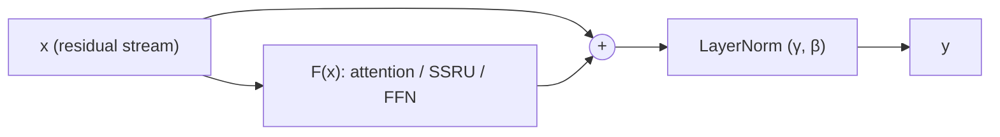
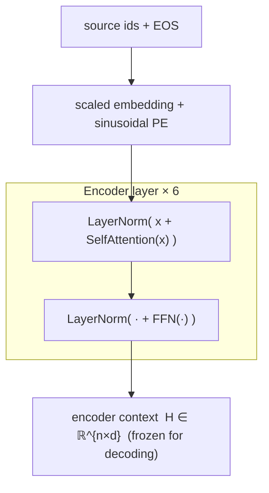
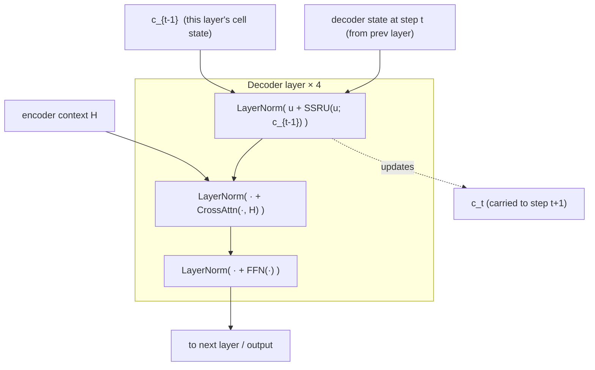
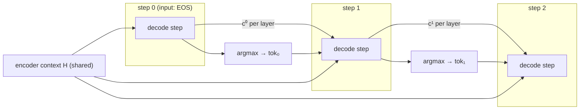
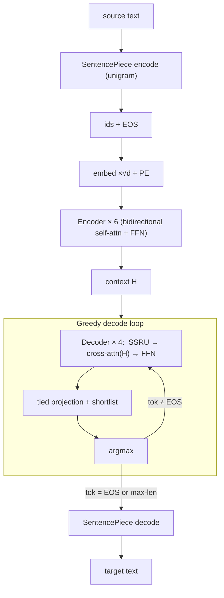

# Firefox Translations model architecture

This documents the internal structure of the shipped Firefox Translations models (the "Bergamot
student") as reconstructed from the reference engine and the recorded trace during the inference-rs
port. The encoder is a textbook Vaswani transformer; the decoder is **not** — its autoregressive
sublayer is an **SSRU** (Simpler Simple Recurrent Unit), which is badly under-documented. The bulk
of this file is spent making that precise and contrasting it with standard self-attention.

Everything below is the `int8shiftAlphaAll` en→fr model; other pairs share the architecture (see
[04-finalize-plan.md](./04-finalize-plan.md) for the config audit). Source references are to
`inference/marian-fork/src`.

## Model at a glance

| Hyperparameter | Symbol | Value |
|---|---|---|
| Embedding / model dim | $d$ | 384 |
| Attention heads | $h$ | 8 |
| Per-head dim | $d_k = d/h$ | 48 |
| FFN inner dim | $d_{ff}$ | 1536 |
| Encoder layers | $L_{enc}$ | 6 |
| Decoder layers | $L_{dec}$ | 4 |
| Vocabulary | $V$ | 32000 (shared, tied) |
| Decoder autoreg. cell | — | **SSRU** (`dec-cell: ssru`) |
| FFN activation | — | ReLU |
| Positions | — | sinusoidal (fixed) |
| Residual arrangement | — | **post-norm** (`preprocess: ""`, `postprocess: dan`) |

Key structural facts, each verified in `special:model.yml` and the trace:

- **Post-norm residuals** (original Vaswani arrangement), not the now-common pre-norm.
- **Tied embeddings everywhere** (`tied-embeddings-all: true`): one matrix $E \in \mathbb{R}^{V\times d}$
  serves input embedding *and* output projection.
- **Encoder = full bidirectional self-attention.** **Decoder = SSRU recurrence + cross-attention.**

## Notation

$u_t \in \mathbb{R}^{d}$ is a layer's input at sequence position $t$; $\odot$ is elementwise
product; $\sigma$ is the logistic sigmoid. Weights are named as in the model file, e.g.
`encoder_l0_self_Wq`, `decoder_l0_rnn_W`, `decoder_l0_context_Wk`, `decoder_l0_ffn_W1`.

## 1. Input representation

Token ids are embedded, scaled, and given sinusoidal position signals (`transformer.h:55`, `:92`):

$$
x_t \;=\; \sqrt{d}\; E[\,\text{id}_t\,] \;+\; \mathrm{PE}(t)
$$

The $\sqrt{d}$ scale (`scalar_mult`, $\approx 19.60$) is applied before adding positions. The
sinusoidal signal uses marian's rotor form (`transformer.h:95`):

$$
\mathrm{PE}(t)_i = \sin\!\big(t\cdot \omega_i + \phi_i\big),\qquad
\omega_i = 10^{-4\,\frac{i \bmod T}{\,T-1\,}},\qquad
\phi_i = \Big\lfloor \tfrac{i}{T}\Big\rfloor\cdot\frac{\pi}{2},\qquad T=\tfrac{d}{2}
$$

The $\phi_i$ offset turns $\sin$ into $\cos$ for the upper half of the dimensions, recovering the
familiar interleaved sin/cos encoding. `transformer-postprocess-emb: d` is dropout only — identity
at inference, so there is **no** embedding layernorm.

## 2. The sublayer skeleton (post-norm residual)

Every sublayer $\mathcal F$ (attention, SSRU, FFN) is wrapped identically. With `preprocess` empty
and `postprocess = dan` (dropout→add→norm), at inference this is:

$$
\mathrm{Sublayer}(x) \;=\; \mathrm{LayerNorm}\big(x + \mathcal F(x)\big)
$$

$$
\mathrm{LayerNorm}(z) = \gamma \odot \frac{z-\mu}{\sqrt{\sigma^2+\epsilon}} + \beta,\quad
\mu=\tfrac1d\textstyle\sum_i z_i,\;\; \sigma^2=\tfrac1d\sum_i (z_i-\mu)^2,\;\; \epsilon=10^{-6}
$$

Post-norm means the residual stream is normalized *after* the add — the norm sits on the trunk, not
inside the branch. (Pre-norm, `LayerNorm` inside $\mathcal F$, would be `preprocess: n`.)

## 3. Multi-head attention (encoder self, decoder cross)

Standard scaled dot-product attention (`transformer.h:228`). Inputs are linearly projected per head,
attended, joined, and output-projected. All four projections are `affine` (weight + bias); the GEMMs
are the `int8shiftAlphaAll` path.

$$
Q = \mathrm{split}_h(x W_q + b_q),\quad K=\mathrm{split}_h(m W_k+b_k),\quad V=\mathrm{split}_h(m W_v+b_v)
$$

$$
\mathrm{Attention}(Q,K,V) = \mathrm{softmax}\!\left(\frac{QK^\top}{\sqrt{d_k}} + M\right) V,\qquad
\text{out} = \mathrm{join}_h(\cdot)\,W_o + b_o
$$

$m=x$ for encoder self-attention (source attends to itself, mask $M$ only hides padding — fully
**bidirectional**). $m=$ encoder output for decoder cross-attention. The two `bdot`s are $QK^\top$ and
$(\cdot)V$; the $1/\sqrt{d_k}$ scale is folded into the first `bdot`.

## 4. Feed-forward network

Two affines with a ReLU between (`transformer.h:407`), $d \to d_{ff} \to d$:

$$
\mathrm{FFN}(x) = \mathrm{ReLU}(x W_1 + b_1)\,W_2 + b_2,\qquad W_1\in\mathbb R^{d\times d_{ff}},\;W_2\in\mathbb R^{d_{ff}\times d}
$$

## 5. Encoder stack

Six identical layers, each two post-norm sublayers; bidirectional, computed once over the whole
source:

## 6. Decoder stack — the SSRU

Here is the part that differs from Vaswani. In a standard transformer decoder the autoregressive
sublayer is **masked multi-head self-attention**: at step $t$ the token attends over *all* previous
target positions $0..t$. That needs a growing key/value cache and costs $O(t)$ attention work per
step.

The Firefox decoder replaces that entire sublayer with an **SSRU** — a gated *recurrence* that
carries a single state vector per layer and costs $O(1)$ per step.

### 6.1 What an SSRU is

The SSRU descends from the SRU (Simple Recurrent Unit, Lei et al. 2018). Start from a full SRU:

$$
\tilde x_t = W x_t,\quad
f_t = \sigma(W_f x_t + v_f\odot c_{t-1} + b_f),\quad
r_t = \sigma(W_r x_t + v_r\odot c_{t-1} + b_r)
$$
$$
c_t = f_t\odot c_{t-1} + (1-f_t)\odot \tilde x_t,\qquad
h_t = r_t\odot g(c_t) + (1-r_t)\odot x_t
$$

The **SSRU ("Simpler SRU")** used here (`rnn/cells.h:982`, Kim et al. 2019) drops the reset gate
$r_t$ **and** the peephole term $v_f\odot c_{t-1}$, and uses ReLU as the output nonlinearity:

$$
\boxed{\;
\begin{aligned}
\tilde x_t &= W\,u_t & &\text{(candidate; a plain \texttt{dot}, no bias)}\\
f_t &= \sigma\big(W_f\,u_t + b_f\big) & &\text{(update/forget gate; an \texttt{affine})}\\
c_t &= f_t\odot c_{t-1} + (1-f_t)\odot \tilde x_t & &\text{(state = the \texttt{highway} op)}\\
h_t &= \mathrm{ReLU}(c_t)
\end{aligned}\;}
$$

The single most important property: **the gate $f_t$ and candidate $\tilde x_t$ depend only on the
current input $u_t$, never on $c_{t-1}$.** The *only* place the recurrence enters is the convex
mixing $c_t = f_t\odot c_{t-1} + (1-f_t)\odot\tilde x_t$. That mixing is exactly the marian
`highway(c_{t-1}, \tilde x_t, f_t)` op — which is why the trace shows a `highway` node inside each
decoder layer.

Equivalently, unrolled, the state is a **learned exponential moving average** of the per-position
candidates:

$$
c_t = \sum_{j\le t}\Big[(1-f_j)\prod_{k=j+1}^{t} f_k\Big]\odot \tilde x_j
$$

The gate decides how much history to keep vs. how much of the new candidate to admit — a
content-based leaky integrator, not a similarity-based lookup.

### 6.2 SSRU vs. Vaswani self-attention

| | Masked self-attention (Vaswani) | SSRU (Firefox decoder) |
|---|---|---|
| Mixes the target prefix via | softmax over $QK^\top$ (content similarity) | gated running average (recency) |
| Parameters | $W_q,W_k,W_v,W_o$ | $W,\,W_f,\,b_f$ |
| State carried across steps | K/V cache, grows $O(t\cdot d)$ | one vector $c_t$, constant $O(d)$ |
| Work per decode step | $O(t\cdot d)$ attention + $O(d^2)$ proj | $O(d^2)$ matmul + $O(d)$ recurrence |
| Full-sequence decode ($n$ steps) | $O(n^2 d + n d^2)$ | $O(n d^2)$ |
| Direct token-to-token interaction | any past position, one hop | only through the running state |
| Depends on $c_{t-1}$ for its gate? | n/a | **no** — gate is input-only |

The gate being input-only is what makes SSRU cheap *and* trainable in parallel: during training all
$\tilde x_t, f_t$ are computed in one batched matmul over the whole sequence, then a fast cumulative
scan produces $c_t$. At inference it collapses to a constant-memory step. This is the trade the
Bergamot student makes: give up attention's flexible target-side mixing to get an $O(n)$,
constant-memory decoder that quantizes well to int8 — a large speedup for on-device CPU translation,
at a small quality cost the distillation recovers.

### 6.3 One decoder layer

Three post-norm sublayers in order (`transformer.h:786`–`849`): SSRU (self / autoregressive), then
cross-attention to the frozen encoder context, then FFN.

Cross-attention keys/values come from the encoder context $H$ and are **cached** — they are
identical across all decode steps, so they are projected once. The SSRU cell state $c_t$, by
contrast, is the per-layer carry that threads the autoregression.

### 6.4 State across the greedy loop

Because each layer keeps only $c_t$ (and the encoder $H$ is fixed), a decode step is independent of
how many tokens were already emitted:

## 7. Output projection (tied embeddings + shortlist)

With `tied-embeddings-all`, the logit projection reuses the embedding matrix $E$:

$$
\text{logits} = h_t\, E^\top + b_{out}
$$

The lexical **shortlist** restricts the columns of $E^\top$ (and $b_{out}$) to a per-sentence
candidate set before the GEMM — this is the `intgemmSelectColumnsB` node. Greedy decoding takes
$\arg\max$ over these logits; length-normalization and word-penalty affect only beam *ranking*, so
they don't change greedy output.

## 8. End-to-end data flow

## 9. Weight naming map

Layer weights follow marian's prefix scheme; these are the names in the model file and the trace.

| Sublayer | Weights |
|---|---|
| Embedding / output (tied) | `Wemb` (+ `decoder_ff_logit_out_b`) |
| Encoder self-attn (layer $i$) | `encoder_l{i}_self_{Wq,bq,Wk,bk,Wv,bv,Wo,bo}`, `encoder_l{i}_self_Wo_ln_{scale,bias}` |
| Encoder FFN | `encoder_l{i}_ffn_{W1,b1,W2,b2}`, `encoder_l{i}_ffn_ffn_ln_{scale,bias}` |
| Decoder SSRU | `decoder_l{i}_rnn_{W,Wf,bf}`, `decoder_l{i}_rnn_ffn_ln_{scale,bias}` |
| Decoder cross-attn | `decoder_l{i}_context_{Wq,bq,Wk,bk,Wv,bv,Wo,bo}`, `..._context_Wo_ln_{scale,bias}` |
| Decoder FFN | `decoder_l{i}_ffn_{W1,b1,W2,b2}`, `decoder_l{i}_ffn_ffn_ln_{scale,bias}` |

Each int8 weight also carries a quantization multiplier (`*_QuantMultA` in the file / appended to the
weight); the affine's `unquant_mult = 1/(q_A q_B)`. See [01-build-plan.md](./01-build-plan.md) for the
int8 GEMM and [04-finalize-plan.md](./04-finalize-plan.md) for how these compose into a full translation.

## References

- Vaswani et al., *Attention Is All You Need*, 2017 — the encoder and cross-attention.
- Lei et al., *Simple Recurrent Units for Highly Parallelizable Recurrence*, EMNLP 2018 — the SRU.
- Kim et al., *From Research to Production and Back: Ludicrously Fast Neural Machine Translation*,
  WNGT 2019 — the SSRU-in-transformer decoder used here.
- `inference/marian-fork/src/models/transformer.h`, `src/rnn/cells.h` — the reference implementation.
